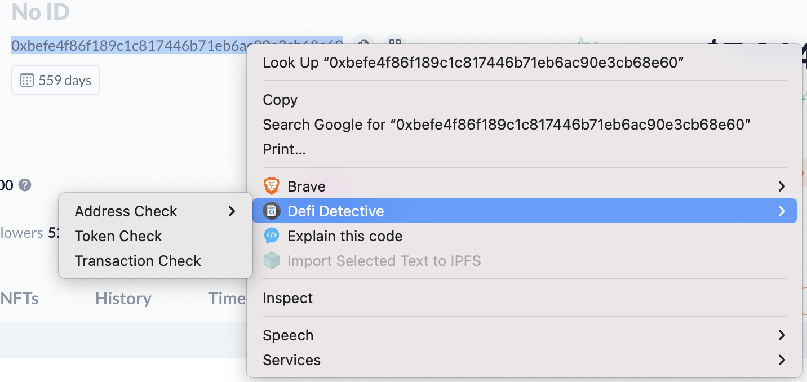

# Defi Detective

Defi Detective is an open source and free assistant for aiding defi investigations.
Defi Detective saves you time! You no longer need to copy and paste strings into all of your investigative resources, let Defi Detective do the work for you.

### Compatibility
Works with Chromium browsers (Chrome, Brave, Edge, etc...)  

## Use

Save time while researching addresses, contracts or transactions with Defi Detective. Simply right click on an address or transaction and Defi Detective will load a number of investigative resources with the highlighted text.

## Options and Features

Save time with common investigative resources. The current list of tools are based off a common list of resources. Feel free to contribute to add more!

Current resources include:

- Search Debank and Etherscan with highlighted addresses.
- Search Tetula for an account anonymity score.
- Load Transaction data into Tenderly and Phalcon.
- Inspect tokens and NFT's with Token Sniffer, Bubblemap and Breadcrumbs.

## Installation
First [download the ZIP](https://github.com/0xKoda/defi-detective/archive/refs/heads/main.zip) and extract the contents. 
    Ensure developer mode is turned on in your chromium browser's extension settings.
    Select "Load unpacked" in your extension settings and select the extracted folder.  
    Ensure the extension is enabled.

# Contributing
Contributions are welcome. If you would like to add a tool to the list of options, simply open a pull request.
